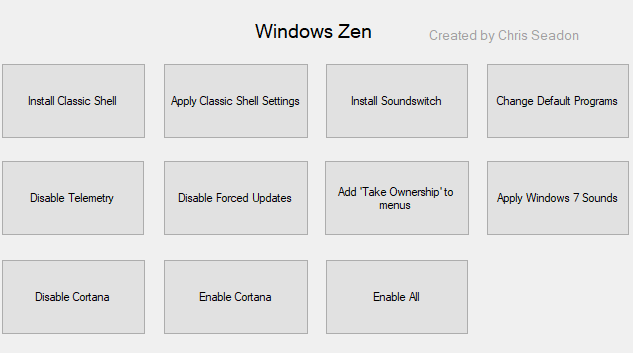

# **Windows Zen**

Windows Zen's aim is to allow users to easily make Windows 10 more like Windows 7 - by changing the sounds, adding a more functional Start Menu ([Classic Shell](https://sourceforge.net/projects/classicshell/?source=directory)) etc. It was created because every time I install Windows 10 I go through a process of installing Classic Shell, disabling telemetry, and applying a lot of other tweaks to make my experience more enjoyable; to make this process simpler I thought I'd make a program to do it for me.

This software heavily relies on registry editing and batch files, so if you are not comfortable with these kind of things being run on your computer you should look elsewhere. You can see all of the files in the source code and in the Program Files\Windows Zen directoy.

## Current tweaks (all optional):

* Classic Shell installation, with my preferred theme & settings (looks like a more modern Windows 7, black by default)
* Soundswitch installation - must have program for anybody with multiple audio devices.
* Installation of VLC, MusicBee, and enabling of Windows Photo Viewer (doesn't always work)
* Removal of Windows 10 default apps, such as Movies & TV and Photos. 
* Disabling of Windows 10's telemetry. If you're serious about that stuff you might want to use [DisableWinTracking](https://github.com/10se1ucgo/DisableWinTracking) as well.
* Disabling of forced updates in Windows 10 **Pro**. Should make the updates act more like Windows 7 (it actually asks).
* Add 'Take Ownership' to contextual menus, to make it easier to delete system files.
* Windows 7 Sounds. Who doesn't love that 'duDU' when you plug your phone in? I'm not sure what the rules are on distributing old Windows sounds, so this may have to be removed in the future. It's probably fine though.
* Disable Cortana. Also can enable if you want it back.

